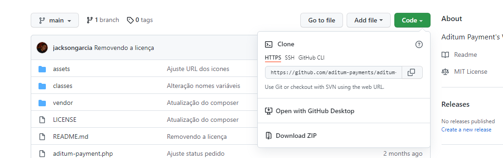
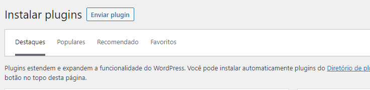
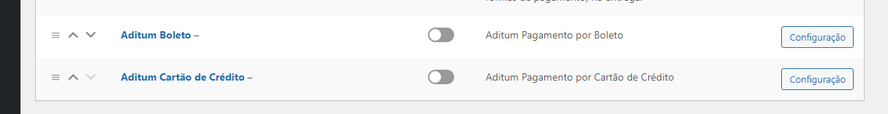
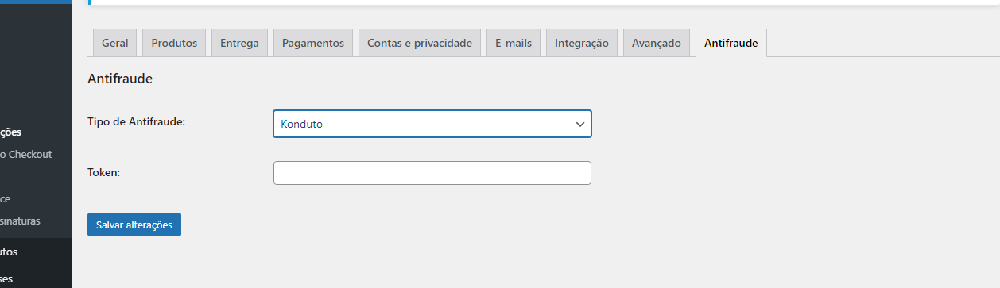

# Aditum WooCommerce

Plugin de pagamentos para o WooCommerce da Aditum

## Compatibilidade

WooCommerce 4.x, 5.x e 6.x

## Funcionalidades

Integrar sua loja virtual WooCommerce com o gateway de pagamentos Aditum

Transações de cartão de crédito

Transações de boleto bancário

Transações de pix

Atualização de status automática

Configuração de parcelamento de cartão

## Requisitos

É necessário instalar o plugin **Extra Checkout Fields for Brazil** para ser exibido o campo de CPF/CNPJ

https://wordpress.org/plugins/woocommerce-extra-checkout-fields-for-brazil

## Instalação Manual
## PASSO 1

Baixa o zip do repositório

## PASSO 2

Acesso **Plugins > Adicionar Novo > Enviar Plugin**

Selecione o arquivo ZIP do plugin, envie e depois ative.

## PASSO 3

Acesso **WooCommerce > Configurações > Pagamentos**

Escolha o método de pagamento que deseja configurar.

## BOLETO

**Habilitar/Desabilitar:** Habilita o módulo para ser exibido no checkout

**Ambiente do Gateway:** Ambiente atual (deixar em sandbox pra testes)

**Título do Gateway:** Título que aparecerá no checkout

**Descrição do Gateway:** Descrição que aparecerá abaixo do título no chekcout

**Instruções Após o Pedido:** Texto que aparece na págian de obrigado e no e-mail do pedido

**Tempo de expiração do Pedido:** Tempo que o link pedido estára disponivel para pagamento

**Tempo de expiração do boleto (Dias):** Validade do boleto

**Dias para multa:** Dias para começar aplicar multa por atraso

**Valor fixo da multa:** Multa fixa

**Valor percentual da multa:** Multa percentual

**Status do Pedido criado:** Status inicial para novos pedidos

**CNPJ:** CNPJ do lijista na conta Aditum

**Merchant Token:** Token da loja

**Definições do Endereço - Rua:** Campo que será usado como rua

**Definições do Endereço - Número:** Campo que será usado como número da rua

**Definições do Endereço - Complemento:** Campo que será usado como complemento

**Definições do Endereço - Bairro:** Campo que será usado como bairro

Configure de acordo com sua necessidade e clique em salvar.

## CARTÃO DE CRÉDITO

**Habilitar/Desabilitar:** Habilita o módulo para ser exibido no checkout

**Ambiente do Gateway:** Ambiente atual (deixar em sandbox pra testes)

**Título do Gateway:** Título que aparecerá no checkout

**Descrição do Gateway:** Descrição que aparecerá abaixo do título no chekcout

**Instruções Após o Pedido:** Texto que aparece na págian de obrigado e no e-mail do pedido

**Valor mínimo da parcela:** Valor mínimo de cada parcela

**Número máximo de parcelas:** quantidade máxima de parcelas disponíveis no checkout

**Status do Pedido criado:** Status inicial para novos pedidos

**CNPJ:** CNPJ do lijista na conta Aditum

**Merchant Token:** Token da loja

**Definições do Endereço - Rua:** Campo que será usado como rua

**Definições do Endereço - Número:** Campo que será usado como número da rua

**Definições do Endereço - Complemento:** Campo que será usado como complemento

**Definições do Endereço - Bairro:** Campo que será usado como bairro

Configure de acordo com sua necessidade e clique em salvar.

## PIX

**Habilitar/Desabilitar:** Habilita o módulo para ser exibido no checkout

**Ambiente do Gateway:** Ambiente atual (deixar em sandbox pra testes)

**Título do Gateway:** Título que aparecerá no checkout

**Descrição do Gateway:** Descrição que aparecerá abaixo do título no chekcout

**Status do Pedido criado:** Status inicial para novos pedidos

**CNPJ:** CNPJ do lijista na conta Aditum

**Merchant Token:** Token da loja

**Definições do Endereço - Rua:** Campo que será usado como rua

**Definições do Endereço - Número:** Campo que será usado como número da rua

**Definições do Endereço - Complemento:** Campo que será usado como complemento

**Definições do Endereço - Bairro:** Campo que será usado como bairro

Configure de acordo com sua necessidade e clique em salvar.

## ANTIFRAUDE

Para configurar o antifraude acesso **WooCommerce > Configurações > Antifraude**

Atualmente temos suporte a Konduto, Clear Sale e Aditum

Insira o token de integração da sua conta.

## WebHook

Configure a **url do webhook** na Aditum para: 

[seusite.com.br]/wc-api/aditum

## Instalação via repositório do WordPress

Pesquisa por **Aditum WooCommerce** na pesquisa de plugins, instale e siga os passos anteriores para configurar o plugin.